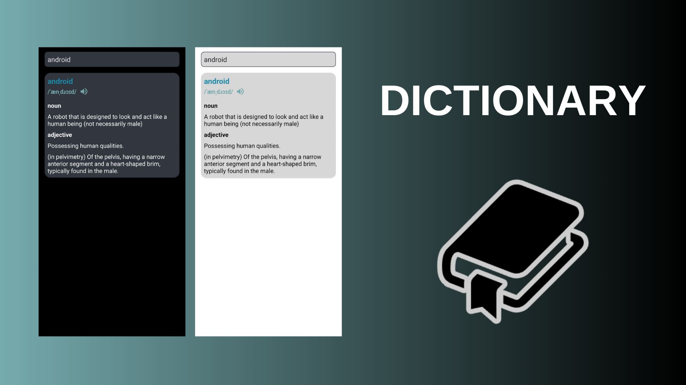

# DICTIONARY

In this app you can search for English word. When you are offline, you can search for previously searched words. When you are online, you can search for words within saved words.

**Word Content**
 
- Word
- Phonetic
- Pronunciation
- Meanings
    * Part of speech
    * Definition
    * Example (some don't)

If you press the audio icon, you can listen pronunciation the word.

**Used**
- Coroutines
- Live Data
- ViewModel
- Dagger Hilt
- Retrofit
- Room
- MVVM Architecture
